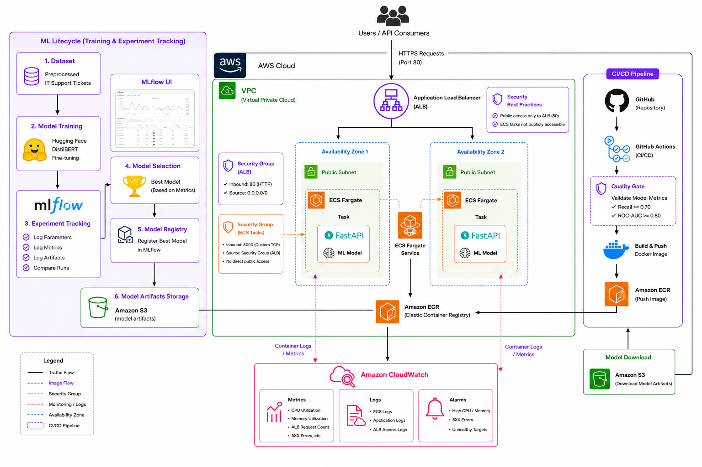
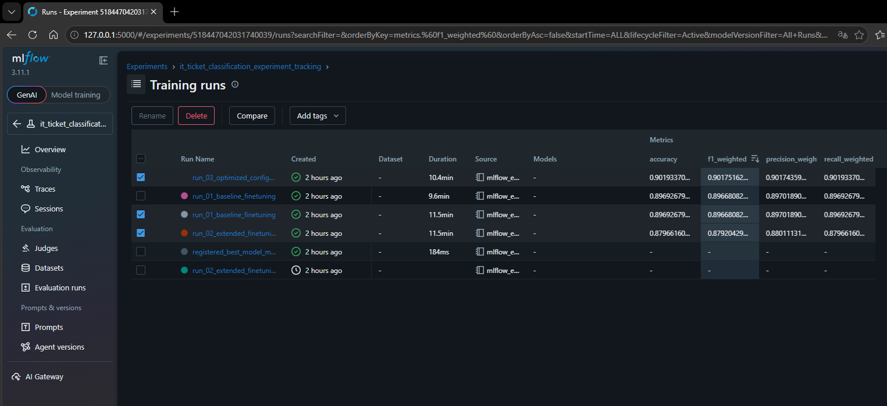
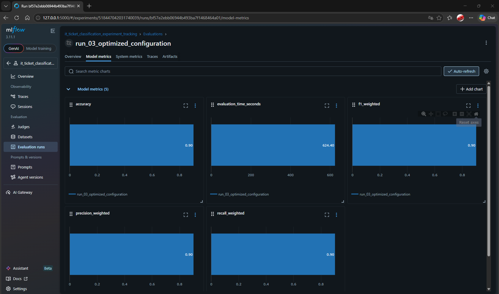
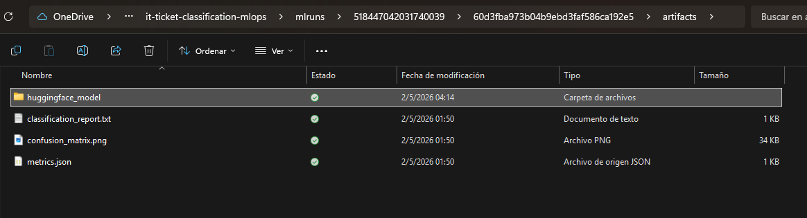
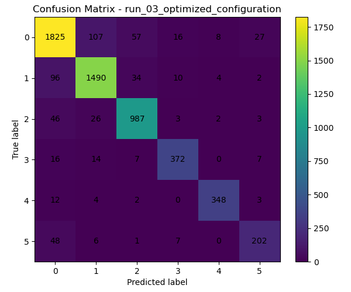
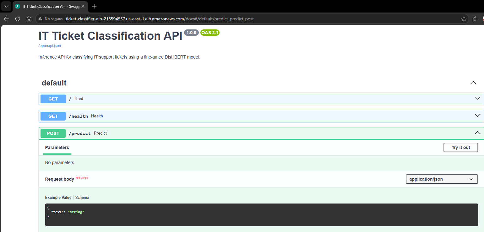
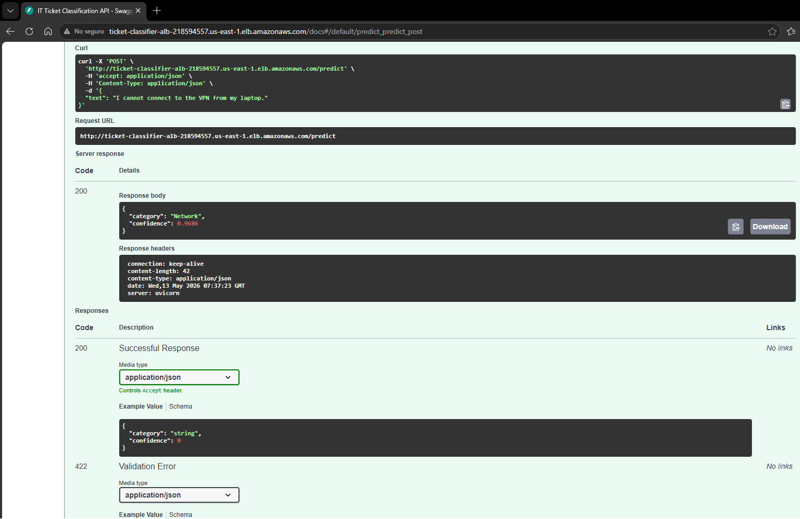
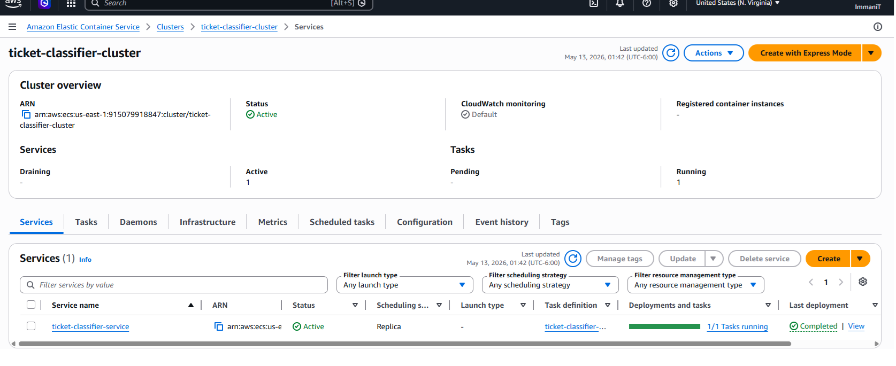
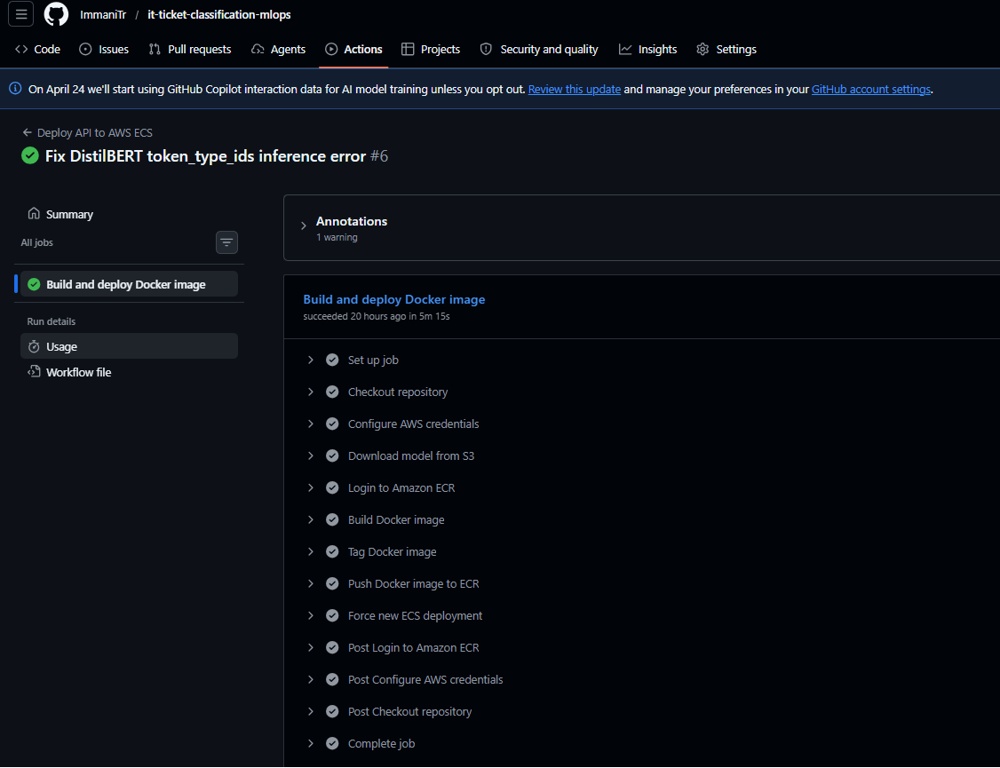
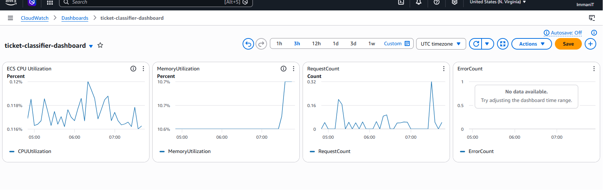

# 🚀 IT Ticket Classification MLOps

Production-grade Natural Language Processing (NLP) project that fine-tunes a DistilBERT model to automatically classify IT support tickets and deploys the resulting model to AWS using a complete MLOps workflow.

---

## 📌 Project Overview

This project demonstrates the end-to-end lifecycle of a Machine Learning solution in production:

- Dataset preparation and preprocessing
- Transfer learning with Hugging Face DistilBERT
- Experiment tracking with MLflow
- Model selection and registry
- Artifact storage in Amazon S3
- API serving with FastAPI
- Docker containerization
- Automated CI/CD with GitHub Actions
- Deployment to Amazon ECS Fargate
- Monitoring with Amazon CloudWatch

The final result is a production-ready REST API that receives raw IT support text and returns the predicted category and confidence score.

---

## 🔗 Repository

GitHub Repository:
https://github.com/ImmaniTr/it-ticket-classification-mlops

---

## 🏗️ Architecture



This diagram summarizes the complete MLOps architecture used in the project. The left side represents the ML lifecycle: dataset preparation, DistilBERT fine-tuning, experiment tracking with MLflow, model selection, and artifact storage in Amazon S3. The center shows the AWS production environment, where the FastAPI application runs inside ECS Fargate tasks behind an Application Load Balancer. The right side shows the CI/CD pipeline, where GitHub Actions downloads the model from S3, builds the Docker image, pushes it to Amazon ECR, and triggers a new ECS deployment. CloudWatch provides monitoring and logging for the deployed service.

---

## 🧠 Machine Learning Lifecycle

- Base Model: `distilbert-base-uncased`
- Framework: Hugging Face Transformers
- Task: Multi-class text classification
- Goal: classify raw IT support tickets into operational categories.

### Categories

- Network
- Hardware
- Software
- Access
- Security

---

## 📊 Experiment Tracking with MLflow

### Training Runs Comparison



This image shows the MLflow experiment table used to compare multiple fine-tuning runs. Each run represents a different training configuration, allowing model performance to be evaluated systematically. The comparison includes key metrics such as accuracy, weighted precision, weighted recall, and weighted F1-score. The best-performing run was selected based on the strongest overall weighted metrics, especially the weighted F1-score.

### Best Run Metrics



This image displays the detailed metrics of the selected best run: `run_03_optimized_configuration`. The model reached approximately 0.90 across accuracy, weighted precision, weighted recall, and weighted F1-score. These metrics indicate balanced performance across the ticket categories and support the decision to promote this run as the production candidate.

| Metric | Value |
|------|------:|
| Accuracy | 0.9019 |
| Precision (Weighted) | 0.9017 |
| Recall (Weighted) | 0.9019 |
| F1 Score (Weighted) | 0.9017 |

### Logged Artifacts



This image shows the artifacts generated and stored during the MLflow run. The artifacts include the saved Hugging Face model, a classification report, a confusion matrix, and a metrics JSON file. This provides traceability and reproducibility, since the model, evaluation results, and supporting files are all linked to the same experiment run.

---

## 🧮 Model Evaluation

### Confusion Matrix



The confusion matrix provides a class-level view of model performance. Most predictions are concentrated along the diagonal, which indicates that the model correctly classified the majority of tickets. Some confusion exists between related IT categories, which is expected in text classification problems where support tickets can share overlapping vocabulary. This visualization helps identify where future improvements could focus, such as collecting more examples for weaker or more ambiguous classes.

---

## 🌐 API Documentation

### Swagger UI



This image shows the public FastAPI Swagger UI exposed through the Application Load Balancer. The API includes three endpoints: `/`, `/health`, and `/predict`. The Swagger interface allows users or recruiters to test the model directly from the browser without needing any additional client or local setup.

### Example Prediction



This image shows a successful real-time prediction from the deployed API. The input text describes a VPN connectivity issue, and the model returns the category `Network` with a confidence score of `0.9686`. This confirms that the deployed container is serving the model correctly, the inference endpoint is functional, and the API returns structured JSON responses.

**Request**

```json
{
  "text": "I cannot connect to the VPN from my laptop."
}
```

**Response**

```json
{
  "category": "Network",
  "confidence": 0.9686
}
```

---

## ☁️ AWS Deployment

### ECS Service Running



This image confirms that the production service is running on Amazon ECS Fargate. The cluster is active, the service is healthy, and one task is running successfully. This demonstrates that the containerized FastAPI application is deployed in AWS and managed by ECS as a production-style service.

### Deployment Stack

- Amazon ECS Fargate
- Amazon ECR
- Amazon S3
- Application Load Balancer
- Amazon CloudWatch

---

## 🔁 CI/CD Pipeline



This image shows the successful GitHub Actions workflow used to automate deployment. The pipeline checks out the repository, configures AWS credentials, downloads the model from S3, logs in to Amazon ECR, builds the Docker image, pushes it to ECR, and forces a new ECS deployment. This makes the deployment process repeatable and automated after changes are pushed to the main branch.

### Pipeline Steps

1. Checkout repository
2. Configure AWS credentials
3. Download model from S3
4. Login to Amazon ECR
5. Build Docker image
6. Push image to ECR
7. Force new ECS deployment

---

## 📈 Monitoring with CloudWatch



This image shows the CloudWatch dashboard created to monitor the deployed API. The dashboard tracks ECS CPU utilization, memory utilization, Application Load Balancer request count, and error count. CPU and memory metrics provide visibility into infrastructure usage, while request count confirms traffic reaching the API. The error count widget helps detect backend or load balancer issues. Together, these metrics add an observability layer to the production deployment.

### Tracked Metrics

- ECS CPU Utilization
- ECS Memory Utilization
- Application Load Balancer Request Count
- Application Load Balancer Error Count

---

## 🔐 GitHub Secrets Used

- `AWS_ACCESS_KEY_ID`
- `AWS_SECRET_ACCESS_KEY`
- `AWS_REGION`
- `AWS_ACCOUNT_ID`
- `ECR_REPOSITORY`
- `ECS_CLUSTER`
- `ECS_SERVICE`
- `S3_MODEL_BUCKET`

---

## 🧰 Tech Stack

### Machine Learning

- Python
- PyTorch
- Hugging Face Transformers
- MLflow

### API and Serving

- FastAPI
- Uvicorn

### Cloud and MLOps

- Docker
- GitHub Actions
- Amazon ECS Fargate
- Amazon ECR
- Amazon S3
- Application Load Balancer
- Amazon CloudWatch

---

## 🎯 Key Skills Demonstrated

- Natural Language Processing (NLP)
- Transfer Learning
- Transformer fine-tuning
- Experiment tracking
- Model selection
- Artifact management
- API development
- Docker containerization
- AWS cloud deployment
- CI/CD automation
- Production monitoring
- MLOps best practices

---

## 🚧 Future Improvements

- Terraform infrastructure as code
- OIDC authentication for GitHub Actions
- Blue/Green deployments
- Automated rollback
- Data drift monitoring
- Model version promotion workflows
- Automated model quality gates before deployment

---

## 👤 Author

Immani Trejo  
Data Science | Machine Learning | NLP | MLOps | AWS

- LinkedIn: https://www.linkedin.com/in/immani-trejo/
- GitHub: https://github.com/ImmaniTr

---

## 📌 Recruiter Note

This project demonstrates the ability to take an NLP model from experimentation to production using a modern MLOps stack.

It combines transformer fine-tuning, experiment tracking, artifact management, API serving, containerization, AWS deployment, CI/CD automation, and production monitoring. The project reflects practical, production-oriented skills expected in Data Science, Machine Learning Engineering, NLP Engineering, and MLOps roles.
